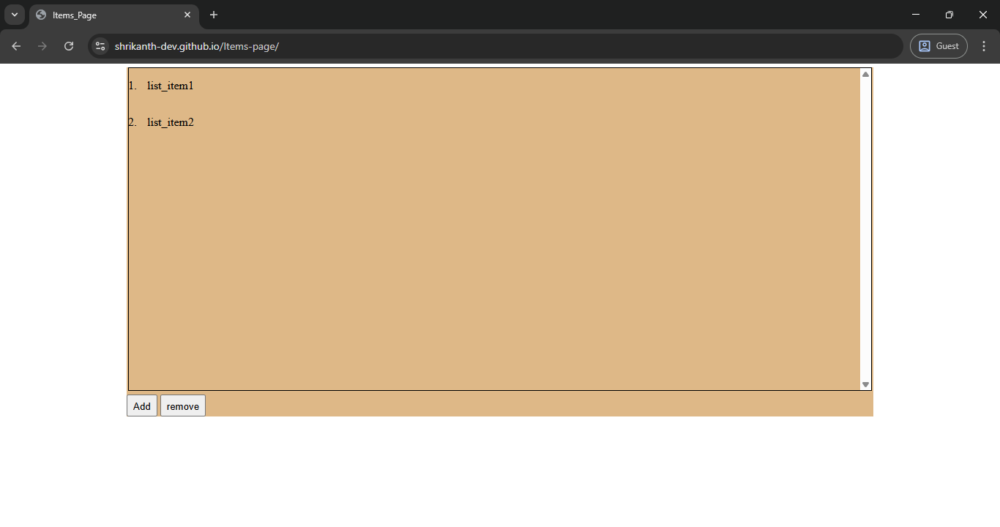

# Items_Page 

## Table of contents

- [Overview](#overview)
  - [The challenge](#the-challenge)
  - [Screenshot](#screenshot)
  - [Links](#links)
  - [Built with](#built-with)
- [Author](#author)

## Overview

A simple HTML, CSS, and JavaScript project demonstrating dynamic list manipulation and class toggling using buttons.

### The challenge

Create an HTML page with:

-An ordered list initialized with two items.

-Two buttons:

  -Add: Appends a new item (<li>new item</li>) to the list and adds a new background color to the container.

  -Remove: Removes the background color by removing the applied class.

-Use vanilla JavaScript DOM manipulation without libraries.

-Implement a scrollable list container with a consistent, clean layout.

### Screenshot

### Links

- Solution URL: [solution URL](https://github.com/shrikanth-dev/Items-page)
- Live Site URL: [live site URL](https://shrikanth-dev.github.io/Items-page/)

### Built with

-HTML5

-CSS3

-Vanilla JavaScript

## Author

- Frontend Mentor - [@shrikanth-dev]
- LinkedIn - [@G Srikanth](https://www.linkedin.com/in/g-srikanth-gs)
